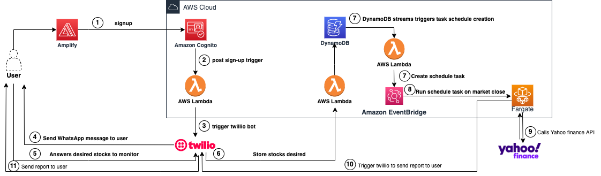

# stocks-report

Projeto da faculdade para criação de um serviço de relatórios de ações.

Através do uso do Amazon Amplify construiremos um front-end modular seguindo as melhores práticas de mercado.

Inicialmente o Amplify será utilizado para integrar com o Amazon Cognito que será responsável pela autenticação dos usuários. 

A escolha do Amazon Amplify e Cognito permite que futuramente seja implementado o uso de MFA (Multi-Factor Authentication) melhorando a segurança da aplicação. O Cognito permite também o  uso de redes sociais para autenticação, melhorando a experiência do usuário.

Após o cadastro do usuário, o sistema utilizará o trigger de post-authentication do Cognito para disparar uma Lambda, que será responsável pelo acionamento da Twilio, permitindo a comunicação entre o agente e o usuário através do WhatsApp.

O agente então irá perguntar quais ações o usuário gostaria de receber os reportes diários, e uma vez obtida a resposta do usuário, irá disparar uma nova Lambda, responsável por armazenar as preferências em uma tabela no banco de dados DynamoDB.

Através do uso do DynamoDB Streams, é possível disparar de maneira assíncrona uma nova Lambda, que será responsável pela criação de uma tarefa schedulada usando o Amazon Event Bridge e o AWS Fargate.

Essa tarefa será executada todo dia no fechamento do mercado, e irá buscar os dados das preferências dos usuários na tabela do DynamoDB,  executando uma chamada para o Yahoo Finance para cada preferência cadastrada. Com o resultado em mãos, essa tarefa irá comunicar a Twilio que enviará o relatório para o usuário através do WhatsApp.

A solução é desenvolvida nativamente na Cloud, usufruindo de soluções Serverless, trazendo um desacoplamento entres os serviços, os tornando mais resilientes e escaláveis.

**Tecnologias usadas:** 
- AWS Amplify, Cognito
- Lambda
- DynamoDB
- Fargate
- Amazon Event Bridge
- Twilio
- Python
- HTML
- JS
- CSS